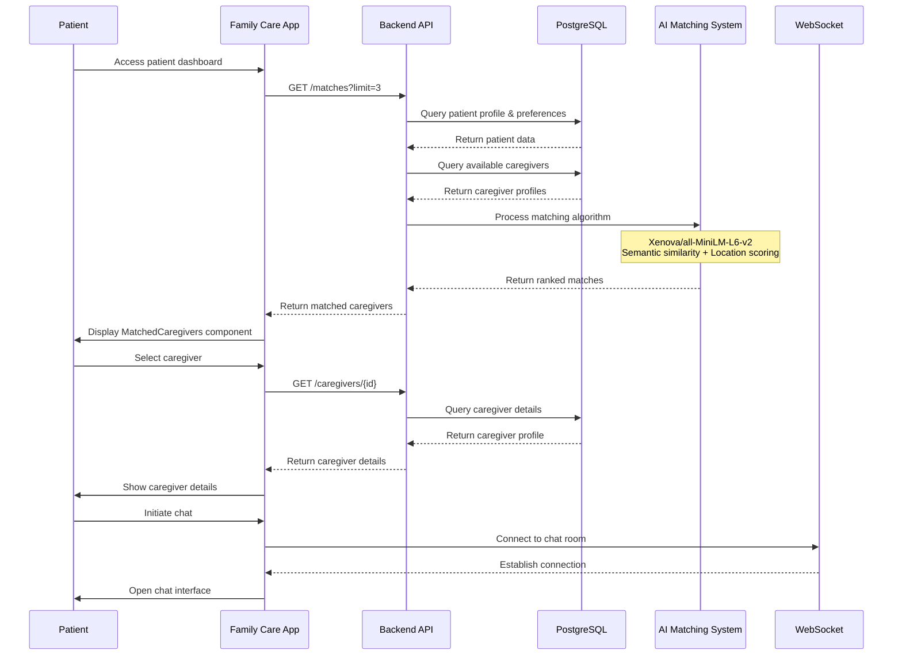
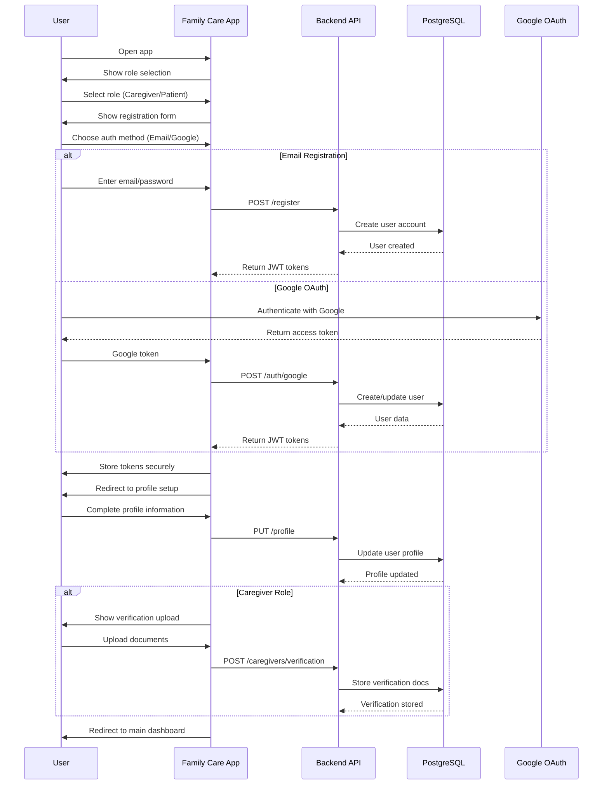
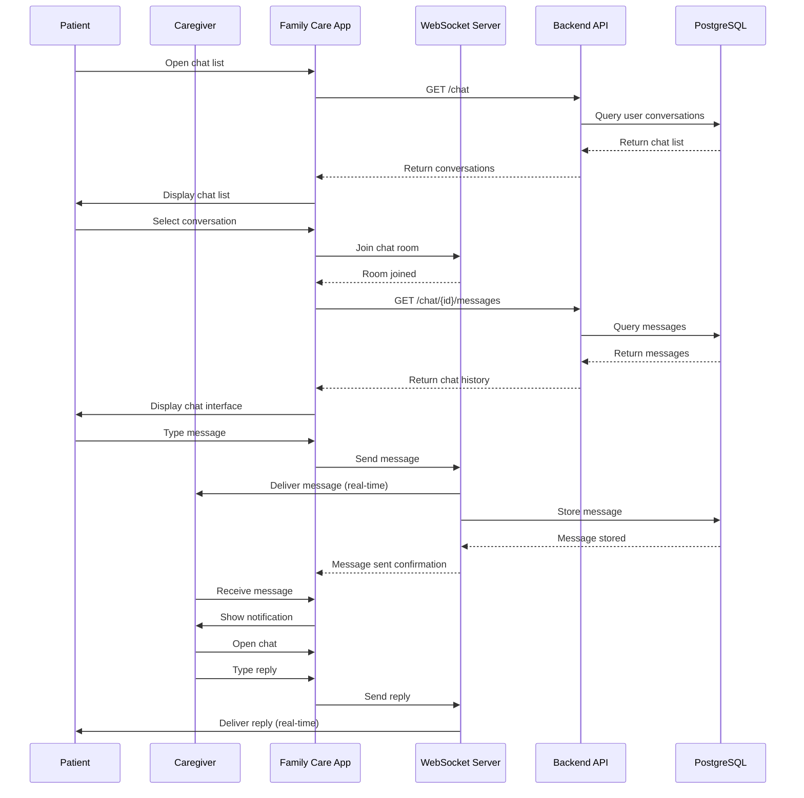
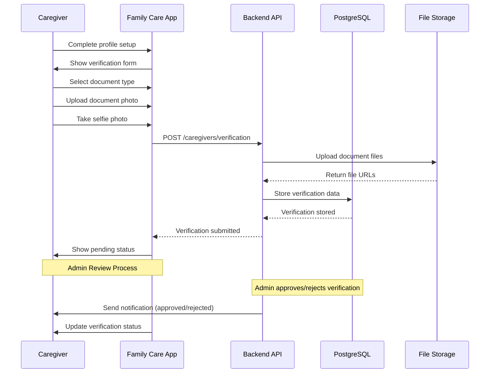
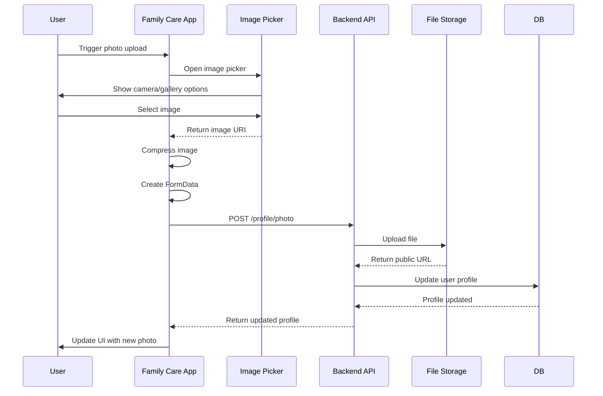
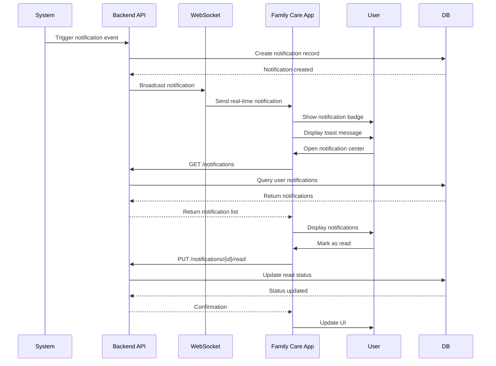
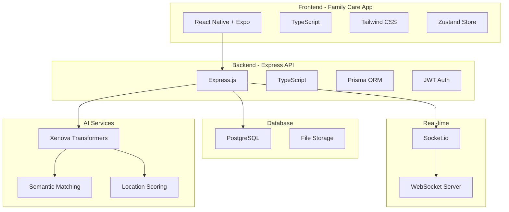
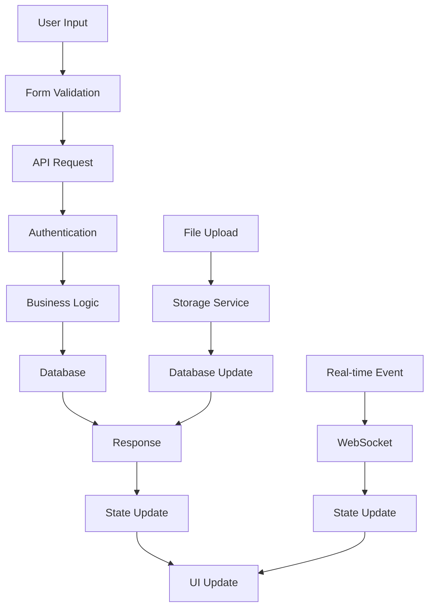

# Family Care Platform - System Diagrams

## 1. Patient-Caregiver Matching Flow



## 2. Authentication Flow



## 3. UI Component Structure (Family Care App)

```mermaid
graph TD
    A[App Root] --> B[Protected Layout]
    A --> C[Auth Layout]
    
    B --> D[Caregiver User]
    B --> E[Patient User]
    B --> F[Shared Components]
    
    D --> G[Caregiver Dashboard]
    D --> H[Caregiver Profile]
    D --> I[Patient Management]
    
    E --> J[Patient Dashboard]
    E --> K[Patient Profile]
    E --> L[Caregiver Search]
    E --> M[Matched Caregivers]
    
    F --> N[Chat System]
    F --> O[Notifications]
    F --> P[Profile Management]
    
    %% Shared Components
    F --> Q[Auth Components]
    F --> R[UI Components]
    F --> S[Global Components]
    
    Q --> T[AuthLayout]
    Q --> U[AuthInputs]
    Q --> V[AuthProviders]
    Q --> W[AuthOTP]
    
    R --> X[Button]
    R --> Y[TextInput]
    R --> Z[Select]
    R --> AA[Loading]
    
    S --> BB[BlurredCircles]
    S --> CC[QuickActionCard]
    S --> DD[Section]
    S --> EE[PendingActions]
    
    %% Feature Components
    N --> FF[ChatList]
    N --> GG[ChatDetail]
    N --> HH[ChatInput]
    N --> II[ChatBubble]
    
    O --> JJ[NotificationBell]
    O --> KK[NotificationItem]
    O --> LL[EmptyNotifications]
    
    P --> MM[ProfileLayout]
    P --> NN[ProfileInput]
    P --> OO[DateInput]
    P --> PP[PhotoPickerSheet]
    
    %% Caregiver Components
    G --> QQ[CaregiverStatusCard]
    G --> RR[GreetingHeader]
    G --> SS[HomeHeader]
    
    %% Patient Components
    L --> TT[SearchBar]
    L --> UU[FilterModal]
    L --> VV[CaregiverCard]
    M --> WW[MatchedCaregivers]
    M --> XX[SectionHeader]
```



## 4. State Management Flow - Zustand Store

```mermaid
graph TD
    A[User Store] --> B[User State]
    A --> C[Auth State]
    A --> D[Profile State]
    
    B --> E[user: User | null]
    B --> F[loadProfile: Function]
    B --> G[updateUser: Function]
    B --> H[logout: Function]
    
    C --> I[isAuthenticated: boolean]
    C --> J[accessToken: string]
    C --> K[refreshToken: string]
    
    D --> L[profileLoading: boolean]
    D --> M[profileError: string]
    
    %% Store Actions
    N[setUser] --> B
    O[loadProfile] --> B
    P[updateUser] --> B
    Q[logout] --> B
    
    %% Component Usage
    R[Auth Components] --> A
    S[Profile Components] --> A
    T[Chat Components] --> A
    U[Navigation] --> A
    
    %% State Updates
    V[API Calls] --> W[Update Store]
    W --> A
    
    %% Persistence
    X[AsyncStorage] --> Y[Token Persistence]
    Y --> A
```

## 5. State Management Comparison

| Feature | Zustand | Redux | Context API |
|---------|---------|-------|-------------|
| **Bundle Size** | ~2KB | ~14KB | Built-in |
| **Boilerplate** | Minimal | High | Medium |
| **TypeScript** | Excellent | Good | Good |
| **DevTools** | Yes | Excellent | Limited |
| **Performance** | Good | Good | Poor (re-renders) |
| **Learning Curve** | Easy | Steep | Easy |
| **Middleware** | No | Yes | No |
| **Our Choice** | ✅ **Zustand** | ❌ Redux | ❌ Context |

## 6. Real-time Chat Flow



## 7. Caregiver Verification Flow



## 8. File Upload Flow



## 9. Notification System Flow



## 10. Family Care Platform Limitations vs Roadmap

| Current Limitation | Impact | Planned Fix | Timeline |
|-------------------|--------|-------------|----------|
| **No Video Call** | Limited communication options | WebRTC + Expo SDK integration | Q2 2024 |
| **Basic Chat** | Text-only messaging | Rich media support (images, files) | Q1 2024 |
| **No Analytics** | No usage insights | Dashboard with usage statistics | Q3 2024 |
| **Limited Search** | Basic filtering | Advanced AI-powered search | Q2 2024 |
| **No Offline Mode** | Requires internet | Offline data sync | Q4 2024 |
| **No Push Notifications** | Manual app checking | Firebase Cloud Messaging | Q1 2024 |
| **No Payment Integration** | Manual payment tracking | Stripe/Paystack integration | Q3 2024 |
| **No Emergency Features** | No emergency protocols | SOS button + emergency contacts | Q2 2024 |
| **Limited File Types** | Images only | Document uploads (PDF, DOC) | Q1 2024 |
| **No Voice Messages** | Text-only chat | Voice message recording | Q2 2024 |

## 11. System Architecture Overview



## 12. Data Flow Architecture



---

**Family Care Platform** - Comprehensive healthcare connection platform with intelligent matching and real-time communication. 